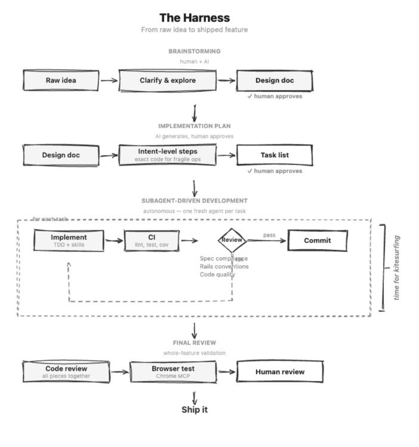

# Superpowers Trainual



Superpowers Trainual is a fork of [Superpowers](https://github.com/obra/superpowers) customized with Trainual's full-stack conventions — JSON:API, ActiveInteractor, Rails engines, RTK Query, TypeScript, and React component patterns.

When installed as a Claude Code plugin, it teaches your coding agent Trainual's codebase conventions and **enforces them via hooks** — the agent must load the relevant convention skill before it can edit governed files.

## How It Works

The plugin injects convention awareness into every coding session:

1. **Session start** — The agent learns it has superpowers and how to use skills
2. **Before any edit** — A PreToolUse hook checks the file type and blocks the edit unless the matching convention skill is loaded
3. **During planning** — Writing-plans and executing-plans skills require loading all conventions before generating tasks
4. **During review** — The rails-reviewer agent validates changes against all convention skills

## Installation

### Claude Code (from GitHub)

```bash
/plugin install trainual/superpowers-rails
```

### Claude Code (from local directory)

```bash
/plugin install /path/to/superpowers-trainual
```

## Convention Skills

### Rails Backend

| Skill | Enforced On | What It Covers |
|-------|-------------|----------------|
| `rails-controller-conventions` | `app/controllers/*.rb` | JSON:API via `Ajax::JSONAPI::BaseController`, concern stack DSL, brownfield awareness |
| `rails-model-conventions` | `app/models/*.rb` | Lean models, engine namespacing, concerns, soft delete patterns |
| `rails-interactor-conventions` | `app/interactors/*.rb` | `ActiveInteractor`, `TransactionOrganizer`, context classes, `after_success` hooks |
| `jsonapi-conventions` | `app/serializers/*.rb` | `jsonapi-serializer` gem, relationships, computed meta, error handling |
| `rails-engine-conventions` | Engine files | `isolate_namespace`, feature gates, cross-namespace references, migration paths |
| `query-object-conventions` | `app/queries/*.rb` | `Patterns::Query`, `.then` pipelines, controller integration |
| `rails-policy-conventions` | `app/policies/*.rb` | Pundit with mandatory `Scope` classes, role hierarchy |
| `rails-testing-conventions` | `spec/*.rb` | Request specs, interactor specs, policy specs, serializer specs |
| `rails-job-conventions` | `app/jobs/*.rb`, `app/workers/*.rb` | Sidekiq workers, idempotency, feature gates in engine workers |
| `rails-migration-conventions` | `db/migrate/*.rb` | Engine table prefixes, reversibility, data safety |
| `rails-view-conventions` | `app/views/*.erb` | ViewComponents, Turbo frames, message passing |
| `rails-stimulus-conventions` | `*_controller.js` | Thin controllers, Turbo-first, cleanup |

### Frontend

| Skill | Enforced On | What It Covers |
|-------|-------------|----------------|
| `typescript-conventions` | `react/*.ts`, `react/*.tsx` | Strict mode, path aliases, no `any`, explicit interfaces |
| `rtk-query-conventions` | `redux/services/*`, `redux/domains/*Slice.ts` | `injectEndpoints`, `transformResponse`/`toCamelCase`, cache tags |
| `dto-transformer-conventions` | `react/types/*`, `react/models/*` | JSON:API type definitions, DTO vs entity types, key-case transformation |
| `react-component-conventions` | `react/components/*.tsx`, `react/hooks/*`, `react/contexts/*` | Functional components, typed props, hooks-first, Saguaro design system |
| `frontend-testing-conventions` | `*.test.tsx`, `*.test.ts` | Vitest + React Testing Library + MSW, accessible queries |

## Workflow Skills

These process skills are inherited from upstream Superpowers and work as-is:

- **brainstorming** — Socratic design refinement before writing code
- **writing-plans** — Bite-sized task decomposition with intent-level steps
- **subagent-driven-development** — Fresh subagent per task with three-stage review
- **executing-plans** — Batch execution with human checkpoints
- **test-driven-development** — RED-GREEN-REFACTOR cycle enforcement
- **systematic-debugging** — 4-phase root cause analysis
- **requesting-code-review** / **receiving-code-review** — Structured review workflow
- **using-git-worktrees** — Isolated development branches
- **finishing-a-development-branch** — Merge/PR decision workflow

## Agents

| Agent | Purpose |
|-------|---------|
| `rails-reviewer` | Reviews changes against all Trainual conventions (backend + frontend). Includes brownfield exemption — only flags violations in new/changed code |
| `code-reviewer` | Reviews against plan alignment, code quality, and architecture |

## Hook Enforcement

The `hooks/rails-conventions.sh` script runs before every Edit/Write/MultiEdit operation. It pattern-matches the file path and blocks the edit unless the matching convention skill has been loaded in the current session.

Example: trying to edit `app/serializers/operations/goal_serializer.rb` without loading `jsonapi-conventions` first will produce:

```
BLOCKED: You must load the superpowers-trainual:jsonapi-conventions skill before editing serializer files.

STOP. Do not immediately retry your edit.
1. Load the skill: Skill(skill: "superpowers-trainual:jsonapi-conventions")
2. Read the conventions carefully
3. Reconsider whether your planned edit follows them
4. Adjust your approach if needed, then edit
```

## Testing

```bash
# Run hook enforcement tests (32 tests, no Claude API needed)
tests/hook-enforcement/run-all.sh

# Run skill triggering tests (requires Claude Code CLI)
tests/skill-triggering/run-all.sh

# Run integration tests (requires Claude Code CLI, 10-30 min)
tests/claude-code/test-subagent-driven-development-integration.sh
```

## Brownfield Awareness

Trainual's codebase has three eras of patterns coexisting:

- **Legacy** (~47% of controllers) — `Ajax::AccountController` + `render_success`/`render_failure` + Panko serializers
- **Transitional** — Main-app interactors (mixed quality), `Patterns::Query`, some JSON:API serializers
- **Modern** (~21% of controllers, growing) — `Ajax::JSONAPI::BaseController` + `TransactionOrganizer` + clean JSON:API

Convention skills **prescribe the modern path** for new work but **acknowledge what exists**. The rails-reviewer agent will not flag convention violations in existing code that wasn't modified in the current changeset.

## License

MIT License — see LICENSE file for details.

## Credits

Forked from [Superpowers](https://github.com/obra/superpowers) by Jesse Vincent.
